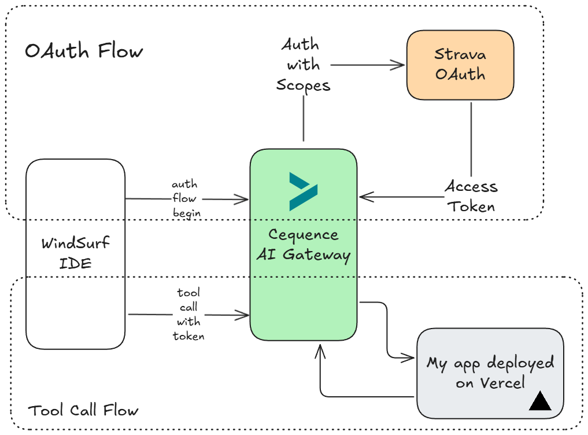

# Fitness Assistant using Strava

**Project name: Fitness Assistant using Strava**

**Short description**

This project implements a Model Context Protocol (MCP) server in python that acts as a bridge to the Strava API with authentication and authorization handled by cequence. It exposes Strava data and analytical functionalities as "tools" that Large Language Models (LLMs) can utilize through the MCP standard.

Features:

- Access recent activities, profile, and stats.
- Fetch detailed activity streams (power, heart rate, cadence, etc.).
- Explore, view, star, and manage segments.
- View detailed activity and segment effort information.
- Activity Analysis
- Performance Insights

**Team name and member names**  
Team Name - mobilab  
Team Members - Abhilash K R (Solo)

**Which hackathon theme / challenge was addressed**

Theme 2: Build a Secure MCP Server for Agents (w/ Cequence)

**How to run it**

Refer [Installation docs](./INSTALLATION.md)

**High Level Diagram**

**Tech stack used (including required tech)**

- Python
   - uv as package manager
   - fastapi
- Cequence AI gateway for authentication and authorization
- Vercel for deployment
- Windsurf as MCP Client

**Demo video link** 

Youtube Video - [Fitness Analysis using Strava](https://www.youtube.com/watch?v=GqpFWU3qQd0)

Smithery Link - [Fitness Analysis Smithery](https://smithery.ai/server/@Better-Boy/strava-mcp)

**What you'd do with more time**

1. Understand Cequence AI gateway better.
2. Integrate with more fitness platforms like intervals.icu, oura ring. Intervals.icu provides highly rich data which is very useful for analysis
3. Implement route map visualization as an endpoint

**My Journey**

* I have to say, Descope runs one of the best blogs on security.
* Through it, I learned a lot about security—a notoriously challenging topic—and how Descope simplifies integrating security into applications.
* Since I was new to the concept of MCP servers, this hackathon gave me the chance to dive deep into MCP and, more importantly, to explore how security can be handled effectively using the Cequence AI Gateway.

Challenges I Faced:

1. I accidentally removed myself from the Cequence user management tab. Thankfully, **Sahit** was quick to add me back.
2. I ran into a roadblock when the Cequence MCP server deployment kept getting stuck without any logs explaining the failure. Eventually, I realized the issue (with sahit's help) was due to specifying an invalid OpenAPI version—something spec parsers like Swagger don’t flag clearly.

Reflections:

Overall, this was an amazing learning journey into both MCP and security.

Acknowledgments:

Thanks to descope, cequence and all sponsors for organizing this event.

Special mention:

* **Sahit Jain** from Cequence, for always stepping in when I was stuck on the gateway.
* **Abhishek Iyer**, for patiently answering questions during the event.

---
## Natural Language Interaction Examples

Here's some of the examples you can try when interacting with claude or any mcp client with LLM.

- Show my recent activities on strava
- Analyze my performance efficiency
- What is my recovery risk after my recent runs?
- Analyze my elevation and give suggestions

Detailed Documentation of the tools can be here - [Tools & Scopes](./ENDPOINT_DETAILS.md)

---

## Contributing

Contributions are welcome! Please feel free to submit a Pull Request.

## License

This project is licensed under the MIT License - see the LICENSE file for details. (Assuming MIT, update if different)
